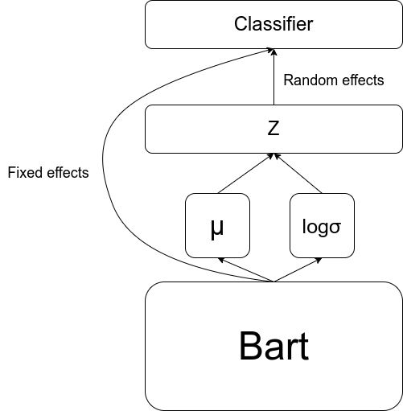
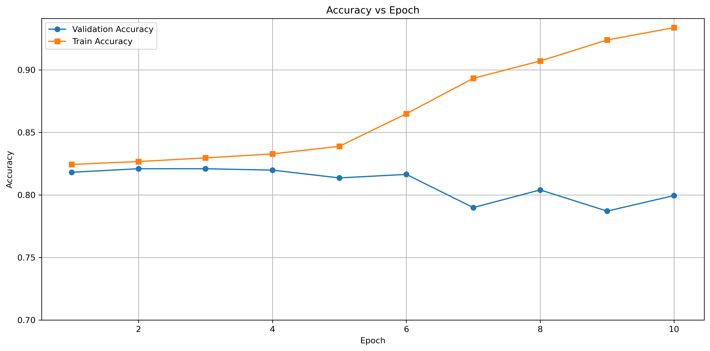
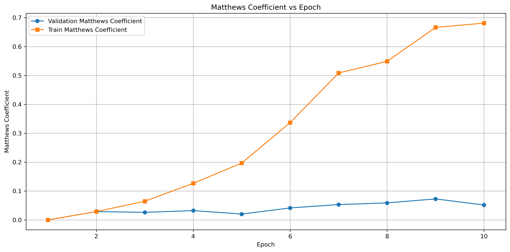
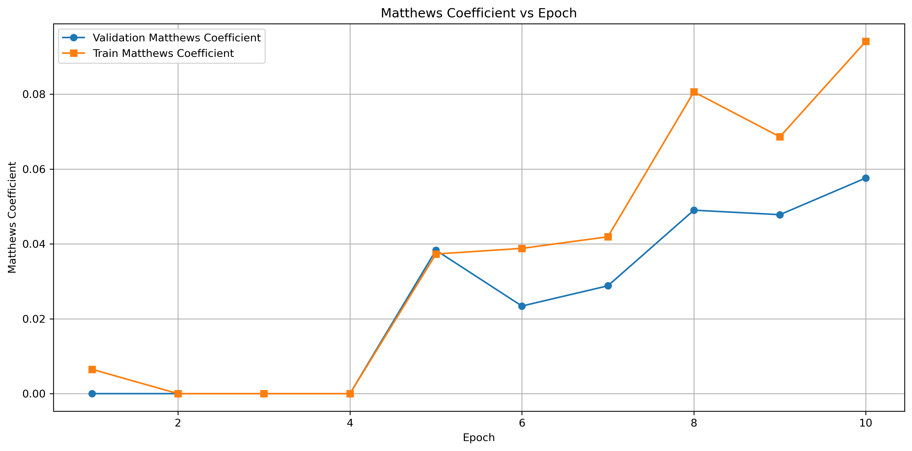

# c[ ]

[](https://www.python.org/downloads/release/python-3100/)
[](https://pytorch.org/)
[](https://www.apache.org/licenses/LICENSE-2.0)
[](https://https://img.shields.io/badge/Status-Final-blue.svg)
[](ai-usage-card.pdf)

- **Group name:** c[]
- **Group code:** G05
- **Group repository:** https://github.com/thisHermit/nlp_project
- **Tutor responsible:** Finn
- **Group team leader:** Madkour, Khaled
- **Group members:**
  - Madkour, Khaled
  - Khan, Bashar Jaan: basharjaankhan[at]gmail.com
  - Khan, Muneeb
  - Assy, Ahmed Tamer

# Setup instructions

> Explain how we can run your code in this section. We should be able to reproduce the results you've obtained.

> In addition, if you used libraries that were not included in the conda environment 'dnlp' explain the exact installation instructions or provide a `.sh` file for the installation.

> Which files do we have to execute to train/evaluate your models? Write down the command which you used to execute the experiments. We should be able to reproduce the experiments/results.

> _Hint_: At the end of the project you can set up a new environment and follow your setup instructions making sure they are sufficient and if you can reproduce your results.

> Following the setup instructions for the different tasks:

### Paraphrase Type Detection

#### Setup

##### Base Setup

Run the setup.sh file or alternatively run the commands below (replacing `<env_name>` with a suitable name.)

```bash
conda create -n <env_name> python=3.10
conda activate <env_name>

# Check for CUDA and install appropriate PyTorch version
if command -v nvidia-smi &>/dev/null; then
    echo "CUDA detected, installing PyTorch with CUDA support."
    conda install pytorch==2.2.0 torchvision==0.17.0 torchaudio==2.2.0 pytorch-cuda=12.1 -c pytorch -c nvidia
else
    echo "CUDA not detected, installing CPU-only PyTorch."
    conda install pytorch==2.2.0 torchvision==0.17.0 torchaudio==2.2.0 cpuonly -c pytorch
fi

# Install additional packages
conda install tqdm==4.66.2 requests==2.31.0 transformers==4.38.2 tensorboard==2.16.2 tokenizers==0.15.1 scikit-learn==1.5.1 -c conda-forge -c huggingface
pip install explainaboard-client==0.1.4 sacrebleu==2.4.0 optuna==3.6.1 smart_pytorch==0.0.4

```

In case the packages above are already installed, use the command below. This task uses 3 external libraries: `smart_pytorch`, `optuna` and `matplotlib`.

```bash
pip install smart_pytorch optuna matplotlib
```

<details>
<summary>(Optionally) To reproduce the plots,</summary>
Install the matplotlib library as well

```bash
conda activate dnlp
conda install
```

</details>

The model was trained and evaluated on the [Grete cluster provided by GWDG](https://gwdg.de/hpc/systems/grete/) on a single H100. To reproduce the experiments, the following command requests a H100 for 2 hours, which are sufficient to run each experiment independently.

```bash
srun -p grete-h100 --pty -n 1 -c 64 -G H100:1 --time 1:00:00 bash
```

<details>
<summary>Command to request resources for <code>&lt;hours&gt;</code> amount of time.</summary>

```bash
srun -p grete-h100 --pty -n 1 -c 64 -G H100:1 --time <hours>:00:00 bash
```

To run all experiments for Paraphrase Type Detection, 6 hours should be more than sufficient.

More details on the [srun options can be found here](https://slurm.schedmd.com/srun.html).

</details>

#### Reproducing experiments

To run any of the experiments, you switch to the corresponding experiment branch and then run the detection script `bart_detection.py`. The general command structure looks like:

```bash
git checkout ptd-exp<x> # here <x> is a branch number
conda activate dnlp # activate the conda environment
python3 bart_detection.py --use_gpu # run the experiment
```

<details>

<summary>bash commands to run each experiment and reproduce the plots</summary>

#### Baseline

```bash
git checkout ptd-exp1
conda activate dnlp
python3 bart_detection.py --use_gpu > exp1.txt 2>&1
mv exp1.txt images/ptd-experiments
cd images/ptd-experiments
python3 csvfier.py exp1.txt
python3 better_pngfier.py exp1.txt-metrics.csv
```

#### Experiment 1

```bash
git checkout ptd-exp2
conda activate dnlp
python3 bart_detection.py --use_gpu > exp2.txt 2>&1
mv exp2.txt images/ptd-experiments
cd images/ptd-experiments
python3 csvfier.py exp2.txt
python3 better_pngfier.py exp2.txt-metrics.csv
```

#### Experiment 2

```bash
git checkout ptd-exp3
conda activate dnlp
python3 bart_detection.py --use_gpu > exp3.txt 2>&1
mv exp3.txt images/ptd-experiments
cd images/ptd-experiments
python3 csvfier.py exp3.txt
python3 better_pngfier.py exp3.txt-metrics.csv
```

#### Experiment 3

```bash
git checkout ptd-exp4
conda activate dnlp
python3 bart_detection.py --use_gpu > exp4.txt 2>&1
mv exp4.txt images/ptd-experimentss
cd images/ptd-experimentss
python3 csvfier.py exp4.txt
python3 better_pngfier.py exp4.txt-metrics.csv
```

#### Experiment 4

```bash
git checkout ptd-exp5
conda activate dnlp
python3 bart_detection.py --use_gpu > exp5.txt 2>&1
mv exp5.txt images/ptd-experiments
cd images/ptd-experiments
python3 csvfier.py exp5.txt
python3 better_pngfier.py exp5.txt-metrics.csv
```

#### Experiment 5

```bash
git checkout ptd-exp6
conda activate dnlp
python3 bart_detection.py --use_gpu > exp6.txt 2>&1
mv exp6.txt images/ptd-experiments
cd images/ptd-experiments
python3 csvfier.py exp6.txt
python3 better_pngfier.py exp6.txt-metrics.csv
```

#### Experiment 6

```bash
git checkout ptd-exp7
conda activate dnlp
python3 bart_detection.py --use_gpu > exp7.txt 2>&1
mv exp7.txt images/ptd-experiments
cd images/ptd-experiments
python3 csvfier.py exp7.txt
python3 better_pngfier.py exp7.txt-metrics.csv
```

#### Experiment 7

```bash
git checkout ptd-exp8
conda activate dnlp
python3 bart_detection.py --use_gpu --optuna_optim > exp8.txt 2>&1
mv exp8.txt images/ptd-experiments
cd images/ptd-experiments
python3 csvfier.py exp8.txt
python3 better_pngfier.py exp8.txt-metrics.csv
```

<details>
<summary><i>Off by one counter error for branch names</i></summary>
Please note that the branch named ptd-exp1 is actually the baseline model branch with the latest commits changes merged in and not the first experiment and so the count in the branch names is off by one.
</details>

</details>

### Paraphrase Type Generation

#### PAWS

Download dataset

```bash
cd data
wget -O train.parquet https://huggingface.co/datasets/google-research-datasets/paws/resolve/main/labeled_final/train-00000-of-00001.parquet
```

```
TOKENIZERS_PARALLELISM=true python3 bart_generation.py --use_gpu
```

Running this commands generates a checkpoint file which saves the model after pre-training on the paws dataset. The model is saved in the file `paws_bart_generation_model.ckpt`.

# Methodology

> In this section explain what and how you did your project.

> If you are unsure how this is done, check any research paper. They all describe their methods/processes. Describe briefly the ideas that you implemented to improve the model. Make sure to indicate how are you using existing ideas and extending them. We should be able to understand your project's contribution.

The methodology of all the different tasks is given below.

## Smart Loss

We implemented a "smart loss" function designed to weigh the importance of harder-to-classify examples during training. This approach aimed to mitigate the impact of class imbalance by dynamically adjusting the loss contribution based on the model's confidence in each prediction. By penalizing incorrect classifications more heavily, especially for underrepresented classes, we improved the model's ability to distinguish between paraphrase types.

## VAE

We introduced a Variational Autoencoder (VAE) into our paraphrase type detection pipeline to capture the latent distributions of paraphrase types more effectively. The VAE component allowed the model to generate paraphrase representations that maintain both diversity and coherence, leading to better generalization across different paraphrase types.



There are random effects that come from the decoder part of the VAE and fixed effects that directly come from the BART model. This combination allowed us to generate more nuanced paraphrase embeddings, enhancing the model's performance on unseen data.

## Focal Loss

To further address the issue of class imbalance, we experimented with focal loss, which down-weights easy-to-classify examples and focuses on harder ones. This modification was particularly useful in scenarios where certain paraphrase types were underrepresented in the training data, helping the model to learn more effectively from these challenging cases.

## Simultaneous Training

We also explored simultaneous training on multiple datasets, including the Quora Question Pairs and other related datasets, to enhance the model's robustness. This approach allowed the model to leverage diverse paraphrase examples during training, resulting in a better understanding of paraphrase type variations across different contexts.

## Cosine Embedding Loss

We introduced Cosine Embedding Loss as a complementary objective to the traditional cross-entropy loss to enhance the semantic quality of the generated paraphrases. While cross-entropy loss focuses on ensuring that the generated output closely matches the target sequence at the token level, it does not explicitly guarantee that the meaning of the generated paraphrase aligns with the target. By incorporating Cosine Embedding Loss, we encouraged the model to generate outputs that are not only syntactically correct but also semantically similar to the target paraphrases.

In our scenario, we implemented Cosine Embedding Loss by extracting the embeddings of both the generated paraphrase and the target paraphrase from BART’s encoder. We then computed the cosine similarity between these embeddings, applying the loss to minimize the difference in meaning between the two sequences. This dual-loss approach allowed us to optimize the model for both grammatical accuracy and semantic fidelity, resulting in more meaningful and contextually appropriate paraphrases.

## Identity Loss

To further enhance the quality of the generated paraphrases and prevent the model from simply replicating the input sequence, we introduced an Identity Loss function. The primary goal of this loss was to discourage the model from generating outputs that are too similar to the input, thus promoting more diverse and meaningful paraphrasing. The Identity Loss was calculated by comparing the input and generated sequences, specifically checking if one text was a substring of the other. If the smaller text appeared within the larger text, a loss of 1 was incurred, otherwise, the loss was set to 0.

In our implementation, we decoded the input and generated sequences from their tokenized form back into text. We then compared the texts to determine if one was a substring of the other. This approach allowed us to penalize the model whenever it produced outputs that closely mirrored the input, thereby encouraging it to generate more varied paraphrases. This method helped to mitigate the risk of the model taking shortcuts by reproducing input sentences with minimal changes, which is often a concern in paraphrase generation tasks.

By combining these three losses during training, we created a multi-objective optimization process where the model was encouraged to generate paraphrases that are accurate (Cross Entropy Loss), semantically meaningful (Cosine Loss), and diverse (Identity Loss).

## Fine-Tuning BART on the PAWS Dataset for Paraphrase Type Generation

To enhance the performance of our paraphrase type generation model, we implemented a two-stage fine-tuning process using BART, starting with the PAWS dataset. The PAWS (Paraphrase Adversaries from Word Scrambling) dataset is a challenging dataset that contains pairs of sentences where word order has been swapped or word substitutions have been made, making it difficult for models to rely on surface form similarity to identify paraphrases. The dataset is designed to test and improve models' ability to capture deep semantic similarity, which aligns closely with the goals of our task.
Fine-Tuning on PAWS

### Objective:

The first step in our methodology was to fine-tune BART on the PAWS dataset, specifically using only the paraphrase pairs labeled as 1 (indicating that the pairs are paraphrases). The rationale behind this choice was that the PAWS dataset is relatively large and challenging, providing a robust starting point for paraphrase-related tasks. By fine-tuning on this dataset, we aimed to leverage the semantic complexity captured in PAWS to enhance BART's ability to generate high-quality paraphrases in our specific task.

### Procedure:

We extracted the paraphrase pairs from the PAWS dataset, filtering out non-paraphrase pairs to focus solely on those labeled as 1. The fine-tuning process involved training BART on these pairs, allowing the model to learn the nuances of paraphrasing from a dataset that closely mimics the kind of sentence structure and semantic similarity challenges present in our target task.

## Fine-Tuning on Our Dataset

After fine-tuning on PAWS, we used the resulting weights as the starting point for fine-tuning BART on our specific dataset for paraphrase type generation. This transfer learning approach was designed to further tailor the model's capabilities to our task, while leveraging the generalized paraphrasing abilities it acquired from the PAWS dataset.

### Combined Loss Function for Paraphrase Detection

In our paraphrase detection workflow, we employ a combined loss function that incorporates Binary Cross-Entropy (BCE) Loss, Cosine Embedding Loss, and Multiple Negative Ranking Loss (MNRL) to effectively capture various aspects of similarity and difference between sentence pairs.

- **BCE Loss** is applied to handle the binary classification aspect of paraphrase detection, ensuring that the model correctly identifies pairs as paraphrases or non-paraphrases.
- **Cosine Embedding Loss** complements this by enforcing that the embeddings of paraphrase pairs are closer together in the vector space, while those of non-paraphrase pairs are pushed apart.
- **Multiple Negative Ranking Loss (MNRL)** further refines the model's capability to distinguish between similar and dissimilar pairs. As outlined by Henderson et al. (2017), MNRL operates by minimizing the distance between true paraphrase pairs while maximizing the distance between mismatched pairs within the same batch. This loss function enhances the model's ability to maintain meaningful distance relationships between paraphrase and non-paraphrase pairs, improving robustness and accuracy.

By combining these three loss functions, we ensure that our model is not only capable of identifying paraphrases with high accuracy but also robustly handles variations in sentence structure and content across diverse paraphrase pairs.

### SMART Regularization Technique

Incorporating the SMART (Smoothness-inducing Adversarial Regularization Training) technique into our loss function introduces a robust fine-tuning strategy that mitigates the risk of overfitting, especially crucial when adapting large pre-trained language models to specific tasks like paraphrase detection. SMART leverages smoothness-inducing regularization, which effectively controls the model's complexity by introducing small perturbations to the input and enforcing consistency in the model's predictions. This approach, based on the principles outlined by Jiang et al. (2020), ensures that the model generalizes well to unseen data, maintaining performance even when subjected to minor variations in input.

### Pooling of Embedding Tokens for Paraphrase Detection

To enhance the robustness of sentence representations for paraphrase detection, we incorporated various pooling strategies into our model. Specifically, we implemented `cls`, `mean`, `max`, and `self-attention` pooling techniques.

- **CLS Pooling**: Utilizes the embedding of the [CLS] token, which is designed to encapsulate the entire sentence's meaning. This method leverages the inherent capability of BERT's [CLS] token to represent sentence-level semantics.
- **Mean Pooling**: Averages the embeddings of all tokens in the sentence, weighted by the attention mask, providing a comprehensive representation of the sentence by considering all its parts.
- **Max Pooling**: Selects the maximum value across token embeddings for each dimension, thereby capturing the most salient features within the sentence.
- **Self-Attention Pooling**: Computes a weighted sum of token embeddings where the weights are determined by a learned attention mechanism. This allows the model to focus on the most informative tokens within a sentence, offering a dynamic and context-aware representation.

These pooling methods allow the model to flexibly capture different aspects of sentence meaning, improving its ability to detect paraphrases by comparing rich and varied sentence representations.

### Multi-Head Attention on BERT Embeddings

Multi-Head Attention (MHA) enhances the model's ability to capture multiple perspectives within a sentence by allowing it to focus on different parts simultaneously. By applying MHA on top of BERT embeddings, we improve the model's representation of sentence pairs, which is particularly useful for tasks like paraphrase detection in our workflow. This approach leverages multiple attention heads to capture diverse aspects of the input, leading to a richer and more nuanced understanding, aiding in the accurate identification of paraphrases.

### Gradual Unfreezing

Inspired by the ULMFiT (Universal Language Model Fine-tuning) approach, we incorporated a gradual unfreezing strategy during the fine-tuning process of our model. This method begins with all layers of the pre-trained BERT model frozen, and progressively unfreezes them over the course of training. The gradual unfreezing allows the model to adapt to the specific downstream task in a controlled manner, reducing the risk of catastrophic forgetting and ensuring that the model retains valuable general features learned during pre-training. This strategy balances leveraging pre-trained knowledge with the need to fine-tune the model effectively for the new task.

# Experiments

> Keep track of your experiments here. What are the experiments? Which tasks and models are you considering?

> Write down all the main experiments and results you did, even if they didn't yield an improved performance. Bad results are also results. The main findings/trends should be discussed properly. Why a specific model was better/worse than the other?

> You are **required** to implement one baseline and improvement per task. Of course, you can include more experiments/improvements and discuss them.

> You are free to include other metrics in your evaluation to have a more complete discussion.

> Be creative and ambitious.

> For each experiment answer briefly the questions:

> - What experiments are you executing? Don't forget to tell how you are evaluating things.
> - What were your expectations for this experiment?
> - What have you changed compared to the base model (or to previous experiments, if you run experiments on top of each other)?
> - What were the results?
> - Add relevant metrics and plots that describe the outcome of the experiment well.
> - Discuss the results. Why did improvement _A_ perform better/worse compared to other improvements? Did the outcome match your expectations? Can you recognize any trends or patterns?

### Paraphrase Type Generation

All experiments for this task are evaulated using MCC. Early stoppping is used within all experiments to use the model with the best Validation MCC. A train val split of 0.9 was used (since the dataset is not very large). Also all accuracy graphs begin at 0.7 (ie 70% accuracy). The hyper-parameters chosen are the same for all the experiments. The reasoning for their values is discussed [here](#hyperparameter-optimization) and also justified by Hyper parameter optimisation using Optuna in Experiment number 7.

<details>
<summary><h4>Experiment 1</h4></summary>

- What experiments are you executing? Don't forget to tell how you are evaluating things.
  - I simply add a learning rate scheduler (ExponentialLR) and early stopping and add another fully connected linear layer.
  - branch name: `ptd-exp2`
- What were your expectations for this experiment?
  - I expected an immediate increase in perfomance as I suspected that a learning rate scheduler would attempt to solve the overfitting observed while fine-tuning.
- What have you changed compared to the base model (or to previous experiments, if you run experiments on top of each other)?
  - in terms of architecture, only a new layer was added on top.
- What were the results?
  - The dev accuracy and mcc are 78.4% and 0.057.
- Add relevant metrics and plots that describe the outcome of the experiment well.

 

- Discuss the results. Why did improvement _A_ perform better/worse compared to other improvements? Did the outcome match your expectations? Can you recognize any trends or patterns?
  - It was later noticed that there was no ReLU layer added between the linear layers at the end and therefore the 2 linear layers effectively collapsed to one. Therefore the results of this experiment are not mentioned in the table below.

</details>

<details>
<summary><h4>Experiment 2</h4></summary>

- What experiments are you executing? Don't forget to tell how you are evaluating things.
  - I use the decoder part of a VAE with skip connections to emulate a mixed effects model.
  - branch name: `ptd-exp3`
- What were your expectations for this experiment?
  - The latent parts of the vae model would capture some aspects of the classification space that would not be captured by a fully connected layer
- What have you changed compared to the base model (or to previous experiments, if you run experiments on top of each other)?
  - The decoder part of the vae is added on top of the base model.
- What were the results?
  - The model performed sligthtly better with a mcc of 0.066.
- Add relevant metrics and plots that describe the outcome of the experiment well.

 

- Discuss the results. Why did improvement _A_ perform better/worse compared to other improvements? Did the outcome match your expectations? Can you recognize any trends or patterns?
  - It is possible that the improvement in performance was completely due to random chance. Experiment 7 does hyperparameter optimization using the optuna package to verify this. The graphs show that the model very overfits to the data.

</details>

<details>
<summary><h4>Experiment 3</h4></summary>

- What experiments are you executing? Don't forget to tell how you are evaluating things.
  - I am adding smart loss to vae.
  - branch name: `ptd-exp4`
- What were your expectations for this experiment?
  - The smart loss should prevent model from overfitting to the training data
- What have you changed compared to the base model (or to previous experiments, if you run experiments on top of each other)?
  - it's the same as experiment 2 but with smart loss added on top
- What were the results?
  - The accuracy for this model is even worse than the base line even if the mcc is better at 0.073.
- Add relevant metrics and plots that describe the outcome of the experiment well.
   

- Discuss the results. Why did improvement _A_ perform better/worse compared to other improvements? Did the outcome match your expectations? Can you recognize any trends or patterns?
  - Even though smart loss was added, the vae overfits to do the data quite a lot. This is unexpected since the randomness should have made the model more generalised instead of more specific to the data.

</details>

<details>
<summary><h4>Experiment 4</h4></summary>

- What experiments are you executing? Don't forget to tell how you are evaluating things.
  - I am using the smart loss on the original architecture (single layer)
  - branch name: `ptd-exp5`
- What were your expectations for this experiment?
  - The model should perform better than the baseline but still worse than the vae
- What have you changed compared to the base model (or to previous experiments, if you run experiments on top of each other)?
  - I have added the smart loss to the existing loss
- What were the results?
  - This experiment provides the highest MCC yet, a MCC of 0.099.
- Add relevant metrics and plots that describe the outcome of the experiment well.

 

- Discuss the results. Why did improvement _A_ perform better/worse compared to other improvements? Did the outcome match your expectations? Can you recognize any trends or patterns?
  - The metrics still diverge but the divergence is slower. There is a jump in epoch 7 but then it slows down again.

</details>

<details>
<summary><h4>Experiment 5</h4></summary>

- What experiments are you executing? Don't forget to tell how you are evaluating things.
  - I am running the simultaneous training experiment here. I am alternatively training the model on the
  - branch name: `ptd-exp6`
- What were your expectations for this experiment?
  - since the model is training on two models simultaneously, I expected the metrics to be erractic but have positive (upward) trend
- What have you changed compared to the base model (or to previous experiments, if you run experiments on top of each other)?
  - I have added another head to train for paraphrase detection and another data loading pipeline for paraphrase detection.
- What were the results?
  - The model performs slightly better than baseline with mcc of 0.058.
- Add relevant metrics and plots that describe the outcome of the experiment well.

 

- Discuss the results. Why did improvement _A_ perform better/worse compared to other improvements? Did the outcome match your expectations? Can you recognize any trends or patterns?
  - The accuracy doesn't reflect the changing loss landscape but the mcc does. Even though this experiment didn't yield the best metric, it's likely that more epochs would improve it's performance (along with higher value for patience)

</details>

<details>
<summary><h4>Experiment 6</h4></summary>

- What experiments are you executing? Don't forget to tell how you are evaluating things.
  - Here I added 4 layers with ReLU and batch norm along with Focal Loss. Each layers looks like the following (except the last one, which is a single linear layer)
    - ```python
      nn.Sequential(
          nn.Linear(linear_size, linear_size),
          nn.LayerNorm(linear_size),
          nn.ReLU(),
          nn.Dropout(dropout_rate),
      )
      ```
  - branch name: `ptd-exp7`
- What were your expectations for this experiment?
  - Focal loss would better solve the class imbalance observed and would result is less over fitting.
- What have you changed compared to the base model (or to previous experiments, if you run experiments on top of each other)?
  - I have added more layers on the base model.
- What were the results?
  - The model performs marginally better with a MCC of 0.062.
- Add relevant metrics and plots that describe the outcome of the experiment well.

 

- Discuss the results. Why did improvement _A_ perform better/worse compared to other improvements? Did the outcome match your expectations? Can you recognize any trends or patterns?
  - The metrics follow each more closely than any other experiment and still diverge slowly. Further experiments with smart loss could give interesting results.

</details>

<details>
<summary><h4>Experiment 7</h4></summary>

- What experiments are you executing? Don't forget to tell how you are evaluating things.
  - Here, I am just running the [optuna](https://optuna.org/) library to find the best hyper-parameters.
  - branch name: `ptd-exp8`
- What were your expectations for this experiment?
  - I expected the hyper-parameters to be similar but still significantly different.
- What have you changed compared to the base model (or to previous experiments, if you run experiments on top of each other)?
  - No architecture change was done. The model from the branch `ptd-exp3` was used.
- What were the results?
  - The best hyper parameters were
    - epochs: 32
    - learning_rate: 9.793615889107144e-06
    - scheduler_gamma: 0.9396559796851901
    - latent_dims: 7
    - patience: 5
- Add relevant metrics and plots that describe the outcome of the experiment well.

  - NA

- Discuss the results. Why did improvement _A_ perform better/worse compared to other improvements? Did the outcome match your expectations? Can you recognize any trends or patterns?
  - The hyper parameters for learning_rate, scheduler_gamma patience are quite similar while that for the epochs are different. Despite that, all experiments were run for 10 epochs so that the plots are comparable despite early stopping.

</details>

## Results

Summarize all the results of your experiments in tables:

| **Stanford Sentiment Treebank (SST)** | **Metric 1** | **Metric n** |
| ------------------------------------- | ------------ | ------------ |
| Baseline                              | 45.23%       | ...          |
| Improvement 1                         | 58.56%       | ...          |
| Improvement 2                         | 52.11%       | ...          |
| ...                                   | ...          | ...          |

| **Quora Question Pairs (QQP)** | **Metric 1** | **Metric n** |
| ------------------------------ | ------------ | ------------ |
| Baseline                       | 45.23%       | ...          |
| Improvement 1                  | 58.56%       | ...          |
| Improvement 2                  | 52.11%       | ...          |
| ...                            | ...          | ...          |

| **Semantic Textual Similarity (STS)** | **Metric 1** | **Metric n** |
| ------------------------------------- | ------------ | ------------ |
| Baseline                              | 45.23%       | ...          |
| Improvement 1                         | 58.56%       | ...          |
| Improvement 2                         | 52.11%       | ...          |
| ...                                   | ...          | ...          |

| **Paraphrase Type Detection (PTD)** | **Accuracy** | **MCC** |
| ----------------------------------- | ------------ | ------- |
| Baseline (exp1)                     | 79.2%\*      | 0.049   |
| VAE (exp3)                          | 80.7%        | 0.092   |
| VAE + smart loss (exp4)             | 78.7%        | 0.073   |
| Smart loss (exp5)                   | 80.5%        | 0.099   |
| Simultaneos training (exp6)         | 82.7%        | 0.058   |
| Deep layers with Focal Loss (exp7)  | 82.6%        | 0.064   |

| **Paraphrase Type Generation (PTG)** | **Metric 1** | **Metric n** |
| ------------------------------------ | ------------ | ------------ |
| Baseline                             | 45.23%       | ...          |
| Improvement 1                        | 58.56%       | ...          |
| Improvement 2                        | 52.11%       | ...          |
| ...                                  | ...          | ...          |

Notes:

- \*_These metrics for the baseline were observed after attempting to confirm and reproduce the final results. The initial recording of these metrics were 82.1% accuracy and 0.069 mcc but they are not longer reproducible._

> Discuss your results, observations, correlations, etc.

> Results should have three-digit precision.

### Hyperparameter Optimization

> Describe briefly how you found your optimal hyperparameter. If you focussed strongly on Hyperparameter Optimization, you can also include it in the Experiment section.

> _Note: Random parameter optimization with no motivation/discussion is not interesting and will be graded accordingly_

## Visualizations

> Add relevant graphs of your experiments here. Those graphs should show relevant metrics (accuracy, validation loss, etc.) during the training. Compare the different training processes of your improvements in those graphs.

> For example, you could analyze different questions with those plots like:

> - Does improvement A converge faster during training than improvement B?
> - Does Improvement B converge slower but perform better in the end?
> - etc...

### Paraphrase Type Generation

#### Baseline

 

#### All experiments together

## Members Contribution

> Explain what member did what in the project:

**Madkour, Khaled:** _implemented the training objective using X, Y, and Z. Supported member 2 in refactoring the code. Data cleaning, etc._

**Khan, Bashar Jaan:** _implemented all the experiments for paraphrase type detection. Supported Muneeb for desinging experiments for paraphrase detection and for paraphrase type generation (identity and paws)._

**Khan, Muneeb:** _implemented all the experiments for paraphrase detection. Supported Bashar for desinging experiments for paraphrase type detection and for paraphrase type generation._

**Assy, Ahmed Tamer:** _implemented the training objective using X, Y, and Z. Supported member 2 in refactoring the code. Data cleaning, etc._

# AI-Usage Card

> Artificial Intelligence (AI) aided the development of this project. Please add a link to your AI-Usage card [here](https://ai-cards.org/).

# References

Write down all your references (other repositories, papers, etc.) that you used for your project.

### TODO: convert links below to proper references

- https://arxiv.org/abs/1312.6114
- https://arxiv.org/abs/1708.02002
- Haoming Jiang, Pengcheng He, Weizhu Chen, Xiaodong Liu, Jianfeng Gao, and Tuo Zhao. SMART: Robust and Efficient Fine-Tuning for Pre-trained Natural Language Models through Principled Regularized Optimization. In Proceedings of the 58th Annual Meeting of the Association for Computational Linguistics, pages 2177–2190, Online, 2020. Association for Computational Linguistics. doi: 10.18653/v1/2020.acl-main.197.
