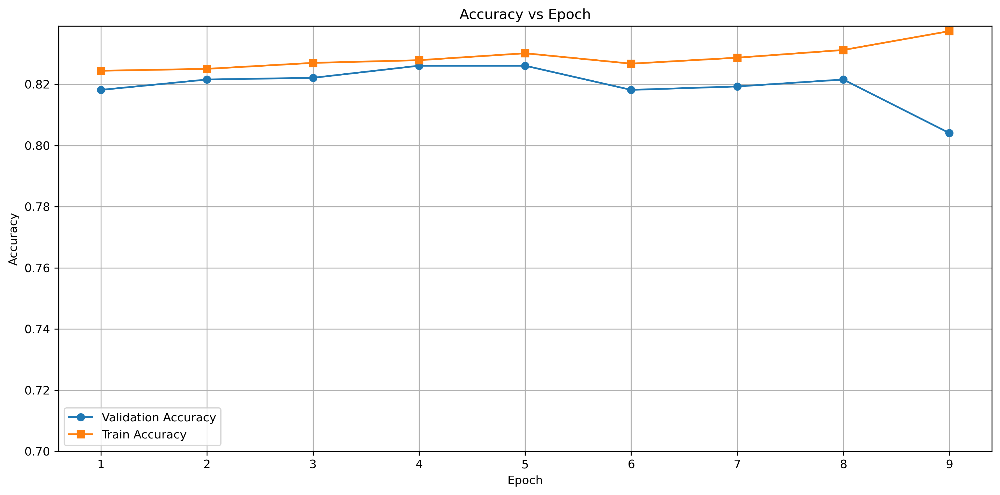
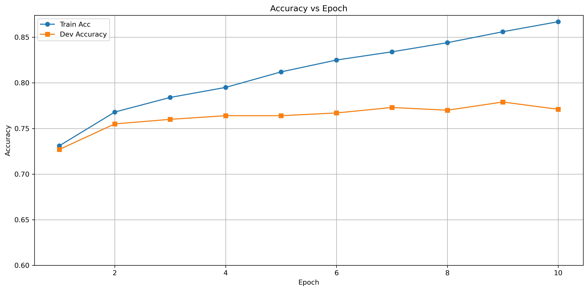
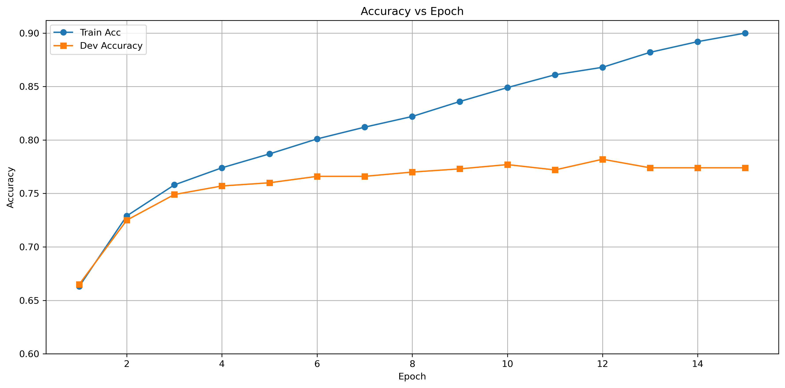
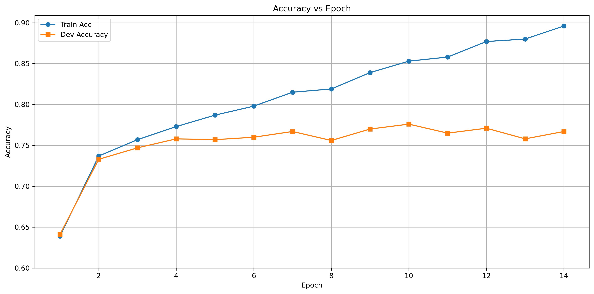

# c[ ]

[](https://www.python.org/downloads/release/python-3100/)
[](https://pytorch.org/)
[](https://www.apache.org/licenses/LICENSE-2.0)
[](https://https://img.shields.io/badge/Status-Final-blue.svg)
[](ai-usage-card.pdf)

- **Group name:** c[]
- **Group code:** G05
- **Group repository:** https://github.com/thisHermit/nlp_project
- **Tutor responsible:** Finn
- **Group team leader:** Madkour, Khaled
- **Group members:**
  - Madkour, Khaled
  - Khan, Bashar Jaan: basharjaankhan[at]gmail.com
  - Khan, Muneeb
  - Assy, Ahmed Tamer

# Setup instructions

> Explain how we can run your code in this section. We should be able to reproduce the results you've obtained.

> In addition, if you used libraries that were not included in the conda environment 'dnlp' explain the exact installation instructions or provide a `.sh` file for the installation.

> Which files do we have to execute to train/evaluate your models? Write down the command which you used to execute the experiments. We should be able to reproduce the experiments/results.

> _Hint_: At the end of the project you can set up a new environment and follow your setup instructions making sure they are sufficient and if you can reproduce your results.

## Base Setup

Run the setup.sh file or alternatively run the commands below (replacing `<env_name>` with a suitable name.)

```bash
conda create -n <env_name> python=3.10
conda activate <env_name>

# Check for CUDA and install appropriate PyTorch version
if command -v nvidia-smi &>/dev/null; then
    echo "CUDA detected, installing PyTorch with CUDA support."
    conda install pytorch==2.2.0 torchvision==0.17.0 torchaudio==2.2.0 pytorch-cuda=12.1 -c pytorch -c nvidia
else
    echo "CUDA not detected, installing CPU-only PyTorch."
    conda install pytorch==2.2.0 torchvision==0.17.0 torchaudio==2.2.0 cpuonly -c pytorch
fi

# Install additional packages
conda install tqdm==4.66.2 requests==2.31.0 transformers==4.38.2 tensorboard==2.16.2 tokenizers==0.15.1 scikit-learn==1.5.1 -c conda-forge -c huggingface
pip install explainaboard-client==0.1.4 sacrebleu==2.4.0 optuna==3.6.1 smart_pytorch==0.0.4 sophia-optimizer==0.2.5
```

> Follow the specific setup instructions for the different tasks:

### Paraphrase Type Detection Setup

#### Setup

This task uses 3 external libraries: `smart_pytorch`, `optuna` and `matplotlib`. Use the command below to install them.

```bash
pip install smart_pytorch optuna matplotlib
```

The model was trained and evaluated on the [Grete cluster provided by GWDG](https://gwdg.de/hpc/systems/grete/) on a single H100. To reproduce the experiments, the following command requests a H100 for 2 hours, which are sufficient to run each experiment independently.

```bash
srun -p grete-h100 --pty -n 1 -c 64 -G H100:1 --time 1:00:00 bash
```

<details>
<summary>Command to request resources for <code>&lt;hours&gt;</code> amount of time.</summary>

```bash
srun -p grete-h100 --pty -n 1 -c 64 -G H100:1 --time <hours>:00:00 bash
```

To run all experiments for Paraphrase Type Detection, 6 hours should be more than sufficient.

More details on the [srun options can be found here](https://slurm.schedmd.com/srun.html).

</details>

#### Reproducing experiments

After getting access to the shell on grete, you can run any experiments. To do so, you switch to the corresponding experiment branch and then run the detection script `bart_detection.py`. The general command structure looks like:

```bash
git checkout ptd-exp<x> # here <x> is a branch number
conda activate dnlp # activate the conda environment
python3 bart_detection.py --use_gpu # run the experiment
```

<details>

<summary>bash commands to reproduce each experiment and the plots</summary>

##### Baseline

```bash
git checkout ptd-exp1
conda activate dnlp
python3 bart_detection.py --use_gpu > exp1.txt 2>&1
mv exp1.txt images/ptd-experiments
cd images/ptd-experiments
python3 csvfier.py exp1.txt
python3 better_pngfier.py exp1.txt-metrics.csv
```

##### Experiment 1

```bash
git checkout ptd-exp2
conda activate dnlp
python3 bart_detection.py --use_gpu > exp2.txt 2>&1
mv exp2.txt images/ptd-experiments
cd images/ptd-experiments
python3 csvfier.py exp2.txt
python3 better_pngfier.py exp2.txt-metrics.csv
```

##### Experiment 2

```bash
git checkout ptd-exp3
conda activate dnlp
python3 bart_detection.py --use_gpu > exp3.txt 2>&1
mv exp3.txt images/ptd-experiments
cd images/ptd-experiments
python3 csvfier.py exp3.txt
python3 better_pngfier.py exp3.txt-metrics.csv
```

##### Experiment 3

```bash
git checkout ptd-exp4
conda activate dnlp
python3 bart_detection.py --use_gpu > exp4.txt 2>&1
mv exp4.txt images/ptd-experimentss
cd images/ptd-experimentss
python3 csvfier.py exp4.txt
python3 better_pngfier.py exp4.txt-metrics.csv
```

##### Experiment 4

```bash
git checkout ptd-exp5
conda activate dnlp
python3 bart_detection.py --use_gpu > exp5.txt 2>&1
mv exp5.txt images/ptd-experiments
cd images/ptd-experiments
python3 csvfier.py exp5.txt
python3 better_pngfier.py exp5.txt-metrics.csv
```

##### Experiment 5

```bash
git checkout ptd-exp6
conda activate dnlp
python3 bart_detection.py --use_gpu > exp6.txt 2>&1
mv exp6.txt images/ptd-experiments
cd images/ptd-experiments
python3 csvfier.py exp6.txt
python3 better_pngfier.py exp6.txt-metrics.csv
```

##### Experiment 6

```bash
git checkout ptd-exp7
conda activate dnlp
python3 bart_detection.py --use_gpu > exp7.txt 2>&1
mv exp7.txt images/ptd-experiments
cd images/ptd-experiments
python3 csvfier.py exp7.txt
python3 better_pngfier.py exp7.txt-metrics.csv
```

##### Experiment 7

```bash
git checkout ptd-exp8
conda activate dnlp
python3 bart_detection.py --use_gpu --optuna_optim > exp8.txt 2>&1
mv exp8.txt images/ptd-experiments
cd images/ptd-experiments
python3 csvfier.py exp8.txt
python3 better_pngfier.py exp8.txt-metrics.csv
```

<details>
<summary><i>Off by one counter error for branch names</i></summary>
Please note that the branch named ptd-exp1 is actually the baseline model branch with the latest commits changes merged in and not the first experiment and so the count in the branch names is off by one.
</details>

</details>

### Paraphrase Type Generation

No extra libraries were used. The following dataset ([PAWS](https://huggingface.co/datasets/google-research-datasets/paws)) was downloaded from huggingface.

```bash
cd data
wget -O train.parquet https://huggingface.co/datasets/google-research-datasets/paws/resolve/main/labeled_final/train-00000-of-00001.parquet
```

#### Reproducing experiments

<details>

<summary>bash commands to reproduce each experiment and the plots</summary>

##### Experiment 1

```bash
git checkout ptg-cos-loss
conda activate dnlp
TOKENIZERS_PARALLELISM=true python3 bart_generation.py --use_gpu > gen_exp1.txt 2>&1
mv gen_exp1.txt images/ptg-experiments
cd images/ptg-experiments
python3 gen_csvfier.py gen_exp1.txt
python3 gen_pngfier.py gen_exp1.txt-metrics.csv

```

##### Experiment 2

```bash
git checkout ptg-paws
conda activate dnlp
TOKENIZERS_PARALLELISM=true python3 bart_generation.py --use_gpu > gen_exp2.txt 2>&1
mv gen_exp2.txt images/ptg-experiments
cd images/ptg-experiments
python3 gen_csvfier.py gen_exp2.txt
python3 gen_pngfier.py gen_exp2.txt-metrics.csv
```

Running this commands generates a checkpoint file which saves the model after pre-training on the paws dataset. The model is saved in the file `paws_bart_generation_model.ckpt`. This file is required to run the next experiment.

##### Experiment 3

This experiment requires a `paws_bart_generation_model.ckpt`. It wasn't included in the repository since it was about 1.6G in size.

```bash
git checkout ptg-best-model
conda activate dnlp
TOKENIZERS_PARALLELISM=true python3 bart_generation.py --use_gpu > gen_exp3.txt 2>&1
mv gen_exp3.txt images/ptg-experiments
cd images/ptg-experiments
python3 gen_csvfier.py gen_exp3.txt
python3 gen_pngfier.py gen_exp3.txt-metrics.csv
```

</details>

### Quora Question Pairs

#### Setup
To run the script for the QQP (Quora Question Pairs) paraphrase detection task, you can use the following example command:

```bash
python multitask_classifier.py --option finetune --task qqp --use_gpu --pooling_type self_attention --lr 1e-5 --local_files_only --epochs 30 --scheduler gradual_unfreeze --freeze_epochs 3 --thaw_epochs 6 --use_mha --use_mlp
```
##### Explanation of the Command And Available Options
- `--option finetune`: This option specifies that the BERT parameters will be updated during training (finetuning).
- `--task qqp`: Specifies that the task is paraphrase detection on the Quora Question Pairs (QQP) dataset.
- `--use_gpu`: Enables GPU usage if available.
- `--pooling_type self_attention`: Uses self-attention pooling for sentence embeddings. Other options include cls, mean, and max.
- `--lr 1e-5`: Sets the learning rate to 1e-5. You can adjust this value depending on your experiments.
- `--local_files_only`: Instructs the script to use local files only, useful if you're running the script offline.
- `--epochs 30`: Runs the training for 30 epochs.
- `--scheduler gradual_unfreeze`: Uses a gradual unfreezing schedule where layers are gradually unfrozen during training.
- `--freeze_epochs 3`: Freezes all BERT layers for the first 3 epochs.
- `--thaw_epochs 6`: Gradually unfreezes layers over the next 6 epochs.
- `--use_mha`: Enables the usage of a Multi-Head Attention layer in the paraphrase classifier.
- `--use_mlp`: Enables the usage of an MLP Head in the paraphrase classifier.

##### Configurable Options
- **Optimizer**: The default optimizer used is Sophia. You can switch to Adam by setting `--optimizer adam`.

```bash

--optimizer adam
```
- **Pooling Type**: The default is `self_attention`. You can choose other pooling methods such as `cls`, `mean`, or `max`.

```bash

--pooling_type cls
```

- **Scheduler**: The default is gradual_unfreeze. You can switch to onecycle by setting:

```bash

--scheduler onecycle
```
- **MLP Head and MHA**: Both `--use_mha` and `--use_mlp` flags are optional. If you do not want to use the MLP head or MHA, simply omit these flags.

# Methodology

> In this section explain what and how you did your project.

> If you are unsure how this is done, check any research paper. They all describe their methods/processes. Describe briefly the ideas that you implemented to improve the model. Make sure to indicate how are you using existing ideas and extending them. We should be able to understand your project's contribution.

The methodology of all the different tasks is given below.

## VAE

We introduced a Variational Autoencoder (VAE) into our paraphrase type detection pipeline to capture the latent distributions of paraphrase types more effectively. The VAE component allowed the model to generate paraphrase representations that maintain both diversity and coherence, leading to better generalization across different paraphrase types.


There are random effects that come from the decoder part of the VAE and fixed effects that directly come from the BART model. This combination allowed us to generate more nuanced paraphrase embeddings, enhancing the model's performance on unseen data.

## Focal Loss

To further address the issue of class imbalance, we experimented with focal loss, which down-weights easy-to-classify examples and focuses on harder ones. This modification is useful in scenarios where since labels 2, 6 and 7 are overrepresented, helping the model to learn more effectively from these challenging cases.

## Simultaneous Training

We also explored simultaneous training on multiple datasets, including the Quora Question Pairs and other related datasets, to enhance the model's robustness. This approach allowed the model to leverage diverse paraphrase examples during training, resulting in a better understanding of paraphrase type variations across different contexts.

## Cosine Embedding Loss

We introduced Cosine Embedding Loss as a complementary objective to the traditional cross-entropy loss to enhance the semantic quality of the generated paraphrases. While cross-entropy loss focuses on ensuring that the generated output closely matches the target sequence at the token level, it does not explicitly guarantee that the meaning of the generated paraphrase aligns with the target. By incorporating Cosine Embedding Loss, we encouraged the model to generate outputs that are not only syntactically correct but also semantically similar to the target paraphrases.

In our scenario, we implemented Cosine Embedding Loss by extracting the embeddings of both the generated paraphrase and the target paraphrase from BART’s encoder. We then computed the cosine similarity between these embeddings, applying the loss to minimize the difference in meaning between the two sequences. This dual-loss approach allowed us to optimize the model for both grammatical accuracy and semantic fidelity, resulting in more meaningful and contextually appropriate paraphrases.

## Identity Loss

To further enhance the quality of the generated paraphrases and prevent the model from simply replicating the input sequence, we introduced an Identity Loss function. The primary goal of this loss was to discourage the model from generating outputs that are too similar to the input, thus promoting more diverse and meaningful paraphrasing. The Identity Loss was calculated by comparing the input and generated sequences, specifically checking if one text was a substring of the other. If the smaller text appeared within the larger text, a loss of 1 was incurred, otherwise, the loss was set to 0.

In our implementation, we decoded the input and generated sequences from their tokenized form back into text. We then compared the texts to determine if one was a substring of the other. This approach allowed us to penalize the model whenever it produced outputs that closely mirrored the input, thereby encouraging it to generate more varied paraphrases. This method helped to mitigate the risk of the model taking shortcuts by reproducing input sentences with minimal changes, which is often a concern in paraphrase generation tasks.

By combining these three losses during training, we created a multi-objective optimization process where the model was encouraged to generate paraphrases that are accurate (Cross Entropy Loss), semantically meaningful (Cosine Loss), and diverse (Identity Loss).

## Fine-Tuning BART on the PAWS Dataset for Paraphrase Type Generation

To enhance the performance of our paraphrase type generation model, we implemented a two-stage fine-tuning process using BART, starting with the PAWS dataset. The PAWS (Paraphrase Adversaries from Word Scrambling) dataset is a challenging dataset that contains pairs of sentences where word order has been swapped or word substitutions have been made, making it difficult for models to rely on surface form similarity to identify paraphrases. The dataset is designed to test and improve models' ability to capture deep semantic similarity, which aligns closely with the goals of our task.
Fine-Tuning on PAWS

The first step in our methodology was to fine-tune BART on the PAWS dataset, specifically using only the paraphrase pairs labeled as 1 (indicating that the pairs are paraphrases). The rationale behind this choice was that the PAWS dataset is relatively large and challenging, providing a robust starting point for paraphrase-related tasks. By fine-tuning on this dataset, we aimed to leverage the semantic complexity captured in PAWS to enhance BART's ability to generate high-quality paraphrases in our specific task.

We extracted the paraphrase pairs from the PAWS dataset, filtering out non-paraphrase pairs to focus solely on those labeled as 1. The fine-tuning process involved training BART on these pairs, allowing the model to learn the nuances of paraphrasing from a dataset that closely mimics the kind of sentence structure and semantic similarity challenges present in our target task.

### Fine-Tuning on Our Dataset

After fine-tuning on PAWS, we used the resulting weights as the starting point for fine-tuning BART on our specific dataset for paraphrase type generation. This transfer learning approach was designed to further tailor the model's capabilities to our task, while leveraging the generalized paraphrasing abilities it acquired from the PAWS dataset.

### Combined Loss Function for Paraphrase Detection

In our paraphrase detection workflow, we employ a combined loss function that incorporates Binary Cross-Entropy (BCE) Loss, Cosine Embedding Loss, and Multiple Negative Ranking Loss (MNRL) to effectively capture various aspects of similarity and difference between sentence pairs.

- **BCE Loss** is applied to handle the binary classification aspect of paraphrase detection, ensuring that the model correctly identifies pairs as paraphrases or non-paraphrases.
- **Cosine Embedding Loss** complements this by enforcing that the embeddings of paraphrase pairs are closer together in the vector space, while those of non-paraphrase pairs are pushed apart.
- **Multiple Negative Ranking Loss (MNRL)** further refines the model's capability to distinguish between similar and dissimilar pairs. As outlined by Henderson et al. (2017), MNRL operates by minimizing the distance between true paraphrase pairs while maximizing the distance between mismatched pairs within the same batch. This loss function enhances the model's ability to maintain meaningful distance relationships between paraphrase and non-paraphrase pairs, improving robustness and accuracy.

By combining these three loss functions, we ensure that our model is not only capable of identifying paraphrases with high accuracy but also robustly handles variations in sentence structure and content across diverse paraphrase pairs.

### SMART Regularization Technique

Incorporating the SMART (Smoothness-inducing Adversarial Regularization Training) technique into our loss function introduces a robust fine-tuning strategy that mitigates the risk of overfitting, especially crucial when adapting large pre-trained language models to specific tasks like paraphrase detection. SMART leverages smoothness-inducing regularization, which effectively controls the model's complexity by introducing small perturbations to the input and enforcing consistency in the model's predictions. This approach, based on the principles outlined by Jiang et al. (2020), ensures that the model generalizes well to unseen data, maintaining performance even when subjected to minor variations in input.

### Pooling of Embedding Tokens for Paraphrase Detection

To enhance the robustness of sentence representations for paraphrase detection, we incorporated various pooling strategies into our model. Specifically, we implemented `cls`, `mean`, `max`, and `self-attention` pooling techniques.

- **CLS Pooling**: Utilizes the embedding of the [CLS] token, which is designed to encapsulate the entire sentence's meaning. This method leverages the inherent capability of BERT's [CLS] token to represent sentence-level semantics.
- **Mean Pooling**: Averages the embeddings of all tokens in the sentence, weighted by the attention mask, providing a comprehensive representation of the sentence by considering all its parts.
- **Max Pooling**: Selects the maximum value across token embeddings for each dimension, thereby capturing the most salient features within the sentence.
- **Self-Attention Pooling**: Computes a weighted sum of token embeddings where the weights are determined by a learned attention mechanism. This allows the model to focus on the most informative tokens within a sentence, offering a dynamic and context-aware representation.

These pooling methods allow the model to flexibly capture different aspects of sentence meaning, improving its ability to detect paraphrases by comparing rich and varied sentence representations.

### Multi-Head Attention on BERT Embeddings

Multi-Head Attention (MHA) enhances the model's ability to capture multiple perspectives within a sentence by allowing it to focus on different parts simultaneously. By applying MHA on top of BERT embeddings, we improve the model's representation of sentence pairs, which is particularly useful for tasks like paraphrase detection in our workflow. This approach leverages multiple attention heads to capture diverse aspects of the input, leading to a richer and more nuanced understanding, aiding in the accurate identification of paraphrases.

### Gradual Unfreezing

Inspired by the ULMFiT (Universal Language Model Fine-tuning) approach, we incorporated a gradual unfreezing strategy during the fine-tuning process of our model. This method begins with all layers of the pre-trained BERT model frozen, and progressively unfreezes them over the course of training. The gradual unfreezing allows the model to adapt to the specific downstream task in a controlled manner, reducing the risk of catastrophic forgetting and ensuring that the model retains valuable general features learned during pre-training. This strategy balances leveraging pre-trained knowledge with the need to fine-tune the model effectively for the new task.

# Experiments

> Keep track of your experiments here. What are the experiments? Which tasks and models are you considering?

> Write down all the main experiments and results you did, even if they didn't yield an improved performance. Bad results are also results. The main findings/trends should be discussed properly. Why a specific model was better/worse than the other?

> You are **required** to implement one baseline and improvement per task. Of course, you can include more experiments/improvements and discuss them.

> You are free to include other metrics in your evaluation to have a more complete discussion.

> Be creative and ambitious.

> For each experiment answer briefly the questions:

> - What experiments are you executing? Don't forget to tell how you are evaluating things.
> - What were your expectations for this experiment?
> - What have you changed compared to the base model (or to previous experiments, if you run experiments on top of each other)?
> - What were the results?
> - Add relevant metrics and plots that describe the outcome of the experiment well.
> - Discuss the results. Why did improvement _A_ perform better/worse compared to other improvements? Did the outcome match your expectations? Can you recognize any trends or patterns?

### Paraphrase Type Detection

- All experiments for this task are evaluated using MCC.
- Early stopping is used within all experiments to use the model with the best Validation MCC.
- A train val split of 0.9 was used (since the dataset is not very large).
- The default loss function is BCEWithLogitsLoss unless mentioned otherwise
- All accuracy graphs begin at 0.7 (ie 70% accuracy).
- The hyper-parameters chosen are the same for all the experiments. The reasoning for their values is discussed [here](#hyperparameter-optimization) and also justified by Hyper parameter optimization using Optuna in Experiment number 7.

<details>
<summary><h4>Experiment 0: Baselline</h4></summary>

 

These are the results of the baseline, where we simply use a linear layer on top of BART model for classification.
</details>

<details>
<summary><h4>Experiment 1: 2 layers with lr scheduler (not included)</h4></summary>

- What experiments are you executing? Don't forget to tell how you are evaluating things.
  - I add a learning rate scheduler (ExponentialLR) and early stopping and add another fully connected linear layer.
  - branch name: `ptd-exp2`
- What were your expectations for this experiment?
  - I expected an immediate increase in perfomance as I suspected that a learning rate scheduler would attempt to solve the overfitting observed while fine-tuning.
- What have you changed compared to the base model (or to previous experiments, if you run experiments on top of each other)?
  - in terms of architecture, only a new layer was added on top.
- What were the results?
  - The dev accuracy and mcc are 78.4% and 0.057.
- Add relevant metrics and plots that describe the outcome of the experiment well.

 

- Discuss the results. Why did improvement _A_ perform better/worse compared to other improvements? Did the outcome match your expectations? Can you recognize any trends or patterns?
  - It was later noticed that there was no ReLU layer added between the linear layers at the end and therefore the 2 linear layers effectively collapsed to one, and therefore not significantly different from the baseline. Therefore the results of this experiment are not mentioned in the table below.

</details>

<details>
<summary><h4>Experiment 2: VAE</h4></summary>

- What experiments are you executing? Don't forget to tell how you are evaluating things.
  - I use the decoder part of a VAE with skip connections to emulate a mixed effects model.
  - branch name: `ptd-exp3`
- What were your expectations for this experiment?
  - The latent parts of the vae model would capture some aspects of the classification space that would not be captured by a fully connected layer
- What have you changed compared to the base model (or to previous experiments, if you run experiments on top of each other)?
  - The decoder part of the vae is added on top of the base model.
- What were the results?
  - The model performed slightly better with a mcc of 0.066.
- Add relevant metrics and plots that describe the outcome of the experiment well.

 

- Discuss the results. Why did improvement _A_ perform better/worse compared to other improvements? Did the outcome match your expectations? Can you recognize any trends or patterns?
  - It is possible that the improvement in performance was completely due to random chance. Experiment 7 does hyperparameter optimization using the optuna package to verify this. The graphs show that the model very overfits to the data.

</details>

<details>
<summary><h4>Experiment 3: VAE + smart loss</h4></summary>

- What experiments are you executing? Don't forget to tell how you are evaluating things.
  - I am adding smart loss to vae.
  - branch name: `ptd-exp4`
- What were your expectations for this experiment?
  - The smart loss should prevent model from overfitting to the training data
- What have you changed compared to the base model (or to previous experiments, if you run experiments on top of each other)?
  - it's the same as experiment 2 but with smart loss added on top
- What were the results?
  - The accuracy for this model is even worse than the base line even if the mcc is better at 0.073.
- Add relevant metrics and plots that describe the outcome of the experiment well.
   

- Discuss the results. Why did improvement _A_ perform better/worse compared to other improvements? Did the outcome match your expectations? Can you recognize any trends or patterns?
  - Even though smart loss was added, the vae overfits to do the data quite a lot. This is unexpected since the randomness should have made the model more generalized instead of more specific to the data.

</details>

<details>
<summary><h4>Experiment 4: Smart loss</h4></summary>

- What experiments are you executing? Don't forget to tell how you are evaluating things.
  - I am using the smart loss on the original architecture (single layer)
  - branch name: `ptd-exp5`
- What were your expectations for this experiment?
  - The model should perform better than the baseline but still worse than the vae
- What have you changed compared to the base model (or to previous experiments, if you run experiments on top of each other)?
  - I have added the smart loss to the existing loss
- What were the results?
  - This experiment provides the highest MCC yet, a MCC of 0.099.
- Add relevant metrics and plots that describe the outcome of the experiment well.

 

- Discuss the results. Why did improvement _A_ perform better/worse compared to other improvements? Did the outcome match your expectations? Can you recognize any trends or patterns?
  - The metrics still diverge but the divergence is slower. There is a jump in epoch 7 but then it slows down again.

</details>

<details>
<summary><h4>Experiment 5: Simultaneos training</h4></summary>

- What experiments are you executing? Don't forget to tell how you are evaluating things.
  - I am running the simultaneous training experiment here. I am alternatively training the model on the
  - branch name: `ptd-exp6`
- What were your expectations for this experiment?
  - since the model is training on two models simultaneously, I expected the metrics to be erratic but have positive (upward) trend
- What have you changed compared to the base model (or to previous experiments, if you run experiments on top of each other)?
  - I have added another head to train for paraphrase detection and another data loading pipeline for paraphrase detection.
- What were the results?
  - The model performs slightly better than baseline with mcc of 0.058.
- Add relevant metrics and plots that describe the outcome of the experiment well.

 

- Discuss the results. Why did improvement _A_ perform better/worse compared to other improvements? Did the outcome match your expectations? Can you recognize any trends or patterns?
  - The accuracy doesn't reflect the changing loss landscape but the mcc does. Even though this experiment didn't yield the best metric, it's likely that more epochs would improve it's performance (along with higher value for patience)

</details>

<details>
<summary><h4>Experiment 6: Deep layers with Focal Loss</h4></summary>

- What experiments are you executing? Don't forget to tell how you are evaluating things.
  - Here I added 4 layers with ReLU and batch norm along with Focal Loss. Each layers looks like the following (except the last one, which is a single linear layer)
    - ```python
      nn.Sequential(
          nn.Linear(linear_size, linear_size),
          nn.LayerNorm(linear_size),
          nn.ReLU(),
          nn.Dropout(dropout_rate),
      )
      ```
  - branch name: `ptd-exp7`
- What were your expectations for this experiment?
  - Focal loss would better solve the class imbalance observed and would result is less over fitting.
- What have you changed compared to the base model (or to previous experiments, if you run experiments on top of each other)?
  - I have added more layers on the base model.
- What were the results?
  - The model performs marginally better with a MCC of 0.062.
- Add relevant metrics and plots that describe the outcome of the experiment well.

 

- Discuss the results. Why did improvement _A_ perform better/worse compared to other improvements? Did the outcome match your expectations? Can you recognize any trends or patterns?
  - The metrics follow each more closely than any other experiment and still diverge slowly. Further experiments with smart loss could give interesting results.

</details>

<details>
<summary><h4>Experiment 7: Optuna Hyperparam tuning</h4></summary>

- What experiments are you executing? Don't forget to tell how you are evaluating things.
  - Here, I am just running the [optuna](https://optuna.org/) library to find the best hyper-parameters.
  - branch name: `ptd-exp8`
- What were your expectations for this experiment?
  - I expected the hyper-parameters to be similar but still significantly different.
- What have you changed compared to the base model (or to previous experiments, if you run experiments on top of each other)?
  - No architecture change was done. The model from the branch `ptd-exp3` was used.
- What were the results?
  - The best hyper parameters were
    - epochs: 32
    - learning_rate: 9.793615889107144e-06
    - scheduler_gamma: 0.9396559796851901
    - latent_dims: 7
    - patience: 5
- Add relevant metrics and plots that describe the outcome of the experiment well.

  - NA

- Discuss the results. Why did improvement _A_ perform better/worse compared to other improvements? Did the outcome match your expectations? Can you recognize any trends or patterns?
  - The hyper parameters for learning_rate, scheduler_gamma patience are quite similar while that for the epochs are different. Despite that, all experiments were run for 10 epochs so that the plots are comparable despite early stopping.

</details>

<details>
<summary><h4>Comparing experiment 4 and 5</h4></summary>


Experiment 4 returns the best mcc while simultaneous training solves the problem of overfitting in the best way. Next experiments could combine the two and note if they give better performance without overfitting.

</details>

### Paraphrase Type Generation

- All experiments for this task are evaluated using the Penalized BLUE Score.
- A train val split of 0.9 was used (since the dataset is not very large).
- The default loss function is Negative log likelihood and the other mentioned in the experiment below are added to it.
- The hyper-parameters chosen are the same for all the experiments. The reasoning for their values is discussed [here](#hyperparameter-optimization).

<details>
<summary><h4>Experiment 0: Baselline</h4></summary>


These are the results of the baseline, where we simply use a linear layer on top of BART model for text generation.

</details>

<details>
<summary><h4>Experiment 1: Cosine Embedding + Identity Loss</h4></summary>

- What experiments are you executing? Don't forget to tell how you are evaluating things.
  - We use a cosine embedding loss, and also later add [identity loss](#identity-loss). This identity loss was added because the generated output replicated the input many times. So the result is a combine loss
    We show the results of the implementations of these 2 losses together.
  - branch name: `ptg-cos-loss`
- What were your expectations for this experiment?
  - We expected an immediate increase in performance as the cosine embedding loss makes sure that the paraphrases are close to each other while simultaneously not being exactly the same.
- What have you changed compared to the base model (or to previous experiments, if you run experiments on top of each other)?
  - only the loss was changed without any architectural changes.
- What were the results?
  - The dev penalized score for cosine embedding loss is 9.94 while that of cosine embedding loss with identity loss is 9.89.
- Add relevant metrics and plots that describe the outcome of the experiment well.

  Cosine loss only
  

  Cosine and identity loss
  

- Discuss the results. Why did improvement _A_ perform better/worse compared to other improvements? Did the outcome match your expectations? Can you recognize any trends or patterns?
  - Both loss functions perform better than the baseline. Identity loss performs slightly worse but it seems to not suffer from over-fitting problem that plain cosine embedding loss suffers from. There room to improve the blue score better by optimizing the weight of the losses involved.

</details>

<details>
<summary><h4>Experiment 2: PAWS pre-train</h4></summary>

- What experiments are you executing? Don't forget to tell how you are evaluating things.
  - Here we pre-train the model on the [paws dataset](#fine-tuning-bart-on-the-paws-dataset-for-paraphrase-type-generation) for 5 epochs (entries that have the label 1, ie true paraphrases) and .
  - branch name: `ptg-paws`
- What were your expectations for this experiment?
  - We expected that pre-training on the paws dataset would have a significant improvement on the Blue score. We also expected the model to generalize better (prevent over-fitting).
- What have you changed compared to the base model (or to previous experiments, if you run experiments on top of each other)?
  - We started from the baseline and add a new dataloader and training loop for the pre-training task
- What were the results?
  - The model performed significantly worse with a blue score of 6.29.
- Add relevant metrics and plots that describe the outcome of the experiment well.


- Discuss the results. Why did improvement _A_ perform better/worse compared to other improvements? Did the outcome match your expectations? Can you recognize any trends or patterns?
  - The model performed quite worse than the baseline. This is because the model doesn't copy the input exactly and thus suffers even if it generalizes better.

</details>

<details>
<summary><h4>Experiment 3: PAWS pre-train + Combined loss</h4></summary>

- What experiments are you executing? Don't forget to tell how you are evaluating things.
  - We use the baseline model trained on paws (experiment 2) and then use the combined loss implemented in experiment 1.
  - branch name: `ptg-best-model`
- What were your expectations for this experiment?
  - We expected to get better results than in Experiment 2 since our loss has a similarity component to it, ie the cosine embedding loss.
- What have you changed compared to the base model (or to previous experiments, if you run experiments on top of each other)?
  - we used the code in experiment 1 and just loaded the model saved in experiment 2
- What were the results?
  - This model performs the best and returns a score of 15.3. (Note: the model goes up to a score of 20.58 but since early stopping isn't implemented, only latest dev score is reported)
- Add relevant metrics and plots that describe the outcome of the experiment well.
  

- Discuss the results. Why did improvement _A_ perform better/worse compared to other improvements? Did the outcome match your expectations? Can you recognize any trends or patterns?
  - Our model performs quite well but suffers from overfitting. Next experiments could improve this by adding regularization.

</details>

### Quora Question Pairs

In this section, we explore various experiments conducted to enhance the performance of our paraphrase detection model. The primary objective is to accurately identify whether pairs of sentences are paraphrases while ensuring the model is robust and generalizes well to unseen data. We experimented with several advanced techniques, including SMART regularization, multi-head attention, and different pooling strategies for embedding generation. Additionally, we adopted a gradual unfreezing strategy during fine-tuning, inspired by the ULMFiT approach, to mitigate overfitting and allow the model to adapt better to the paraphrase detection task.

Throughout all experiments, we utilized the Sophia optimizer with its default hyperparameter settings, chosen for its ability to leverage second-order information, offering more precise learning rate adjustments that enhance stability, efficiency, and convergence speed during training. Each experiment was evaluated using the Quora Question Pairs (QQP) dataset, and the outcomes were assessed based on accuracy.

Below, we delve into the specific experiments, discussing their design, expectations, results, and insights gained.

<details>
<summary><h4>Experiment 0: Baseline</h4></summary>


These are the results of the baseline, where we simply use a linear layer on top of BERT embeddings for classification.

</details>

<details>
<summary><h4>Experiment 1: Combined Loss Function Over Baseline BERT Model with Simple Linear Classifier Head</h4></summary>

This experiment involved implementing a combined loss function—comprising Binary Cross-Entropy (BCE) Loss, Cosine Embedding Loss, and Multiple Negatives Ranking Loss (MNRL)—over the baseline BERT model for the paraphrase detection task using the Quora dataset. The model's performance was evaluated based on its accuracy on the validation set after each training epoch.

**Expectations for this experiment**

The expectation was that the combined loss function would enhance the model’s capability to differentiate between paraphrases and non-paraphrases more effectively by leveraging both classification and embedding similarities, thus improving validation accuracy.

**Changes compared to the previous experiment**

The key modification in this experiment was the introduction of the combined loss function, incorporating BCE, Cosine Embedding Loss, and MNRL. The architecture remained the same with a simple linear classifier head, but the loss calculation was more sophisticated than the baseline, which only used BCE.

**Results**

The experiment showed a minor improvement in the model’s validation accuracy, reaching 0.772 compared to the baseline 0.771. However, the training accuracy was significantly higher, suggesting the model was able to learn well on the training data but struggled to generalize as effectively to the validation set.

**Relevant Metrics and Visualization.**


The key metrics were the training and validation accuracies. By the end of the experiment, the training accuracy reached 0.951, while the validation accuracy plateaued at 0.772, indicating a potential overfitting issue.

**Discussion of the results**
While the combined loss function did improve the validation accuracy slightly, the significant gap between the training and validation accuracies points to overfitting. This suggests that while the model could capture complex patterns in the training data, it did not generalize well to unseen data. This outcome partly matched expectations—improvement was seen, but it highlighted the need for better regularization techniques or adjustments to the model to prevent overfitting. The trend suggests that the model may benefit from techniques like early stopping, dropout, or SMART regularization to improve generalization.

</details>

<details>
<summary><h4>Experiment 2: SMART Regularization with Combined Loss Function</h4></summary>

**What experiments are you executing? Don't forget to tell how you are evaluating things.**

In this experiment, I incorporated SMART (Smoothness-Inducing Adversarial Regularization Training) alongside the combined loss function (Binary Cross-Entropy Loss, Cosine Embedding Loss, and Multiple Negatives Ranking Loss) used in Experiment 1. The objective was to assess whether SMART could enhance the model's generalization and further improve validation accuracy. The model was evaluated based on its performance on the validation set of the paraphrase detection task.

**Expectations for this experiment**

I expected SMART regularization to reduce the overfitting observed in Experiment 1, leading to a smaller gap between training and validation accuracies. Additionally, I anticipated that this would result in a higher validation accuracy compared to Experiment 1, due to better generalization to unseen data.

**Changes compared to the previous experiment**

The primary change from Experiment 1 was the addition of SMART regularization. This was layered on top of the combined loss function without altering other aspects of the model or training process, allowing for a clear assessment of SMART's impact.

**Results**

The model with SMART regularization achieved a validation accuracy of 0.775, which is an improvement from the 0.772 obtained in Experiment 1. The training accuracy increased more moderately to 0.839 by the end of training, indicating that SMART successfully curbed overfitting while slightly boosting generalization.

**Relevant Metrics and Visualization**


By the end of the experiment, the model had a training accuracy of 0.839 and a validation accuracy of 0.775. The continuous increase in validation accuracy up to epoch 10, with the final accuracy at 0.775, suggests that the model benefitted from the regularization provided by SMART.

**Discussion of the results**

The addition of SMART regularization led to a slight but consistent improvement in validation accuracy, from 0.772 in Experiment 1 to 0.775 in this experiment. This outcome is consistent with expectations, as SMART is designed to reduce overfitting, which was a concern in Experiment 1. The results suggest that while SMART regularization contributes to better generalization, the improvement is incremental, indicating that further enhancements or adjustments in hyperparameters may be necessary for more significant gains. The trend of increasing validation accuracy suggests that SMART was effective, but the diminishing returns in later epochs also point to a potential limit in its impact when used in isolation.

</details>

<details>
<summary><h4>Experiment 3: Mean Pooling with SMART Regularization and Combined Loss Function</h4></summary>

In this experiment, I incorporated a mean pooling strategy for sentence embeddings in addition to the SMART regularization and combined loss function used in Experiment 2. The objective was to determine whether averaging the token embeddings (mean pooling) could improve the model's ability to generalize better to unseen paraphrase pairs. The model's performance was evaluated on the validation set using accuracy as the primary metric.

**Expectations for this experiment**

I expected that the mean pooling strategy would provide a more robust representation of sentences, capturing more contextual information compared to using only the [CLS] token embedding. This could potentially lead to better paraphrase detection performance, particularly in scenarios where important information is spread throughout the sentence rather than being concentrated at the beginning.

**Changes compared to the previous experiment**

The key modification in this experiment was the use of mean pooling for sentence embeddings instead of solely relying on the [CLS] token. This change was layered on top of the SMART regularization and combined loss function approach used in Experiment 2.

**Results**

The experiment concluded with a validation accuracy of 0.778, an improvement over the 0.775 accuracy achieved in Experiment 2. The final training accuracy reached 0.864, indicating continued strong performance on the training set, but the improvement in validation accuracy suggests that mean pooling helped in generalizing better to the validation data.

**Relevant Metrics and Visualization**


The model achieved a final validation accuracy of 0.778, with a corresponding training accuracy of 0.864 by epoch 10. This improvement over Experiment 2 suggests that mean pooling contributed to better sentence representation and, consequently, better performance on the paraphrase detection task.

**Discussion of the results**

The integration of mean pooling led to a slight improvement in validation accuracy, which suggests that this pooling method provided a more comprehensive representation of sentence meaning, enhancing the model's ability to detect paraphrases. The results align with the expectations that mean pooling would capture more contextual information from the entire sentence, leading to better generalization. However, the modest increase in performance also indicates that while mean pooling helps, it may not be a transformative change on its own, but rather a beneficial adjustment that, when combined with other improvements, contributes to incremental gains. The training accuracy remained high, but the gap between training and validation accuracy indicates that overfitting is still a concern, albeit slightly mitigated compared to earlier experiments.

</details>

<details>
<summary><h4>Experiment 4: Self-Attention Pooling with SMART Regularization and Combined Loss Function</h4></summary>

In this experiment, I incorporated a self-attention pooling mechanism for sentence embeddings, replacing the previous mean pooling method. The aim was to allow the model to dynamically weigh different parts of the sentence, potentially capturing more nuanced relationships within sentence pairs. This approach was combined with the SMART regularization and the same combined loss function used in the earlier experiments. The evaluation was based on the model's accuracy on the validation set.

**Expectations for this experiment**

I expected that self-attention pooling would provide a more context-aware representation of sentences, leading to better paraphrase detection by allowing the model to focus on the most relevant parts of each sentence. This could enhance the model's ability to discern subtle paraphrasing nuances, leading to improved performance on the validation set.

**Changes compared to the previous experiment**

The key modification in this experiment was the use of self-attention pooling for sentence embeddings, replacing the mean pooling strategy from Experiment 3. This was built on top of the SMART regularization and combined loss function from the previous experiments.

**Results**

The experiment concluded with a validation accuracy of 0.779, marking a slight improvement over the 0.778 accuracy achieved in Experiment 3. The final training accuracy was 0.867, indicating continued strong performance on the training set. The results suggest that self-attention pooling did provide some benefit, albeit modest, in terms of validation accuracy.

**Relevant Metrics and Visualization**



The model reached a final validation accuracy of 0.779, with a corresponding training accuracy of 0.867 by epoch 10. The consistent improvement in validation accuracy throughout the training epochs highlights the potential of self-attention pooling in enhancing the model's ability to generalize to unseen data.

**Discussion of the results**

The introduction of self-attention pooling led to a marginal improvement in validation accuracy, suggesting that the model benefited from the ability to focus on different parts of the sentence according to their relevance. This aligns with the expectations that self-attention pooling would allow the model to capture more nuanced sentence representations. However, the improvement was not substantial, indicating that while self-attention pooling is beneficial, its impact is relatively incremental when added on top of the existing SMART regularization and combined loss function. The gap between training and validation accuracy, while still present, was slightly reduced, suggesting a better generalization capability compared to previous experiments.

</details>

<details>
<summary><h4>Experiment 5: Early Stopping and OneCycleLR Scheduler with Self-Attention Pooling and SMART Regularization</h4></summary>

In this experiment, I introduced two new techniques: Early Stopping and the OneCycleLR learning rate scheduler. Early Stopping was used to prevent overfitting by halting training when the validation performance stopped improving, allowing us to extend the number of training epochs to 20. OneCycleLR was applied with a maximum learning rate of three times the initial learning rate to help the model converge more effectively. These additions were combined with the previously used self-attention pooling, SMART regularization, and combined loss function. The model’s performance was evaluated based on its accuracy on the validation set.

**Expectations for this experiment**

I expected that Early Stopping would prevent the model from overfitting by stopping training at the optimal point, while OneCycleLR would allow the model to explore a wider range of learning rates, potentially leading to better convergence and improved performance on the validation set. With Early Stopping in place, I anticipated that training for more epochs (up to 20) would allow the model to fully exploit the data while still avoiding overfitting.

**Changes compared to the previous experiment**

The main changes in this experiment were the introduction of Early Stopping and the OneCycleLR scheduler, allowing for an increased number of epochs. These were added on top of the setup from Experiment 4, which included self-attention pooling, SMART regularization, and a combined loss function.

**Results**

The model achieved a validation accuracy of 0.782 by epoch 12, with the best model being saved at that point. The final training accuracy was 0.900, indicating strong performance on the training set. However, the early stopping mechanism was triggered after epoch 15 due to a lack of further improvement in validation accuracy, confirming its role in preventing overfitting.

**Relevant Metrics and Visualization**



The experiment saw the validation accuracy gradually improve from 0.665 in the first epoch to 0.782 by epoch 12. The use of OneCycleLR helped maintain a relatively smooth training process, and Early Stopping ensured that training did not continue unnecessarily once the validation accuracy plateaued. The final saved model had a validation accuracy of 0.782 and a training accuracy of 0.900.

**Discussion of the results**

The introduction of Early Stopping effectively prevented overfitting, which was a concern in previous experiments. The OneCycleLR scheduler contributed to a more effective training process by dynamically adjusting the learning rate, allowing the model to achieve a slightly higher validation accuracy compared to earlier experiments. The ability to train for up to 20 epochs provided the model with more opportunities to learn, but Early Stopping ensured that training was halted when further improvements were unlikely. However, the gap between training and validation accuracy remains, indicating some level of overfitting. Overall, these techniques helped optimize the training process, leading to a well-tuned model that performed robustly on the validation set.

</details>

<details>
<summary><h4>Experiment 6: Incorporating an MLP Head with Self-Attention Pooling</h4></summary>

In this experiment, I replaced the simple linear classifier with a Multi-Layer Perceptron (MLP) head while retaining self-attention pooling for embedding aggregation. The MLP head consists of three layers with a dropout probability of 0.3 and incorporates residual connections where applicable. The goal was to determine if the additional complexity of the MLP head would improve the model's performance on paraphrase detection tasks. The model's performance was evaluated based on accuracy on the validation set.

**Expectations for this experiment**

I expected that the MLP head, with its additional layers and residual connections, would enable the model to capture more complex patterns in the data, potentially leading to improved accuracy compared to the simpler linear classifier used in previous experiments.

**Changes compared to the previous experiment**

The main change in this experiment was the introduction of the MLP head, which replaced the linear classifier used in earlier experiments. This MLP head is designed with three layers, ReLU activations, dropout layers for regularization, and residual connections to help stabilize training. This was combined with self-attention pooling, which had shown promise in Experiment 4. Additionally, the model was trained for up to 20 epochs with Early Stopping in place, ensuring that training would halt once validation performance plateaued.

**Results**

The model achieved a validation accuracy of 0.779 by epoch 12, with the best model being saved at that point. The final training accuracy reached 0.916, indicating strong learning on the training set. Early Stopping was triggered after epoch 16, preventing further training as the validation accuracy did not improve beyond 0.779.

**Relevant Metrics and Visualization**


The experiment saw validation accuracy improve from 0.696 in the first epoch to 0.779 by epoch 12. The use of an MLP head allowed the model to achieve a slight improvement in performance over previous experiments, particularly when combined with self-attention pooling.

**Discussion of the results**

The introduction of the MLP head provided a modest improvement in validation accuracy compared to earlier experiments with simpler classifiers. The additional layers in the MLP head, along with the residual connections, likely allowed the model to capture more complex relationships in the data, contributing to better performance. However, the gap between training and validation accuracy suggests that the model still experienced some overfitting, even with Early Stopping in place. Overall, this experiment demonstrated that the MLP head, combined with self-attention pooling, could enhance the model's ability to generalize, leading to the highest validation accuracy observed so far.

</details>

<details>
<summary><h4>Experiment 7: Adding Multi-Head Attention Layer</h4></summary>

In this experiment, I incorporated a Multi-Head Attention (MHA) layer on top of the BERT embeddings. The MHA layer aims to enhance the model's ability to focus on different parts of the input sequences simultaneously, potentially capturing more nuanced relationships between sentence pairs. The paraphrase detection task was used to evaluate the model's performance, with validation accuracy being the primary metric.

**Expectations for this experiment**

I expected that the addition of the Multi-Head Attention layer would allow the model to better capture complex dependencies between words in each sentence pair, leading to improved performance on the paraphrase detection task.

**Changes compared to the previous experiment**

The main modification in this experiment was the integration of a Multi-Head Attention layer after obtaining the sentence embeddings from BERT. This layer, configured with a specific number of attention heads and a dropout mechanism, was designed to refine the embeddings further before they were fed into the classifier. This setup was compared to the previous experiments that did not include MHA.

**Results**

The model achieved a validation accuracy of 0.776 at its best, which was observed after 10 epochs of training. The training accuracy reached 0.853 by the same epoch. Early Stopping was triggered at epoch 14, as the model's performance plateaued on the validation set.

**Relevant Metrics and Visualization**



Validation accuracy started at 0.641 in the first epoch and progressively improved, reaching 0.776 by epoch 10. However, the model did not consistently improve beyond this point, which led to Early Stopping.

**Discussion of the results**

The introduction of the Multi-Head Attention layer provided a small performance boost compared to the previous experiments, particularly in the early stages of training. This suggests that MHA helped the model capture more complex patterns in the data. However, the performance gains plateaued relatively quickly, which may indicate that while MHA provided some benefits, the model may still be limited by other factors, such as the architecture of the final classifier or overfitting to the training data. The results aligned with the expectation that MHA could improve performance, though the improvement was not as substantial as hoped. The observed trend suggests that while MHA can enhance the model's capabilities, other improvements may be necessary to fully leverage its potential.

</details>

<details>
<summary><h4>Experiment 8: Gradual Unfreezing with Custom Scheduler</h4></summary>

In this experiment, I implemented a Gradual Unfreezing strategy using a custom scheduler (GradualUnfreezeScheduler) instead of the OneCycleLR scheduler. The main idea behind gradual unfreezing is to start with only the classifier layers being trained and gradually unfreeze and train the earlier layers of the BERT model as training progresses. This approach can help in stabilizing the training, especially in the early stages, and allow the model to focus on learning the classifier parameters first. The evaluation was conducted on the paraphrase detection task, using validation accuracy as the key metric.

**Expectations for this experiment**

I expected that Gradual Unfreezing would improve the model's stability during training and lead to better generalization by fine-tuning the BERT layers progressively. This method was anticipated to yield better or at least comparable performance to previous experiments where the model was trained with OneCycleLR.

**Changes compared to the previous experiment**

The primary change in this experiment was the replacement of the OneCycleLR scheduler with the custom GradualUnfreezeScheduler. This scheduler gradually unfreezes the BERT layers over the course of training. Specifically, we used the following parameters:

- `freeze_epochs=3`: The first 3 epochs keep all BERT layers frozen.
- `thaw_epochs=6`: Over the next 6 epochs, layers are progressively unfrozen.
- `max_lr=3e-05`: The learning rate gradually increases to this maximum value during the thawing phase.

**Results**

The model achieved a best validation accuracy of 0.776 by the 12th epoch. Training accuracy at this point was 0.858. Early Stopping was triggered at epoch 14, indicating that the model's performance plateaued. The Gradual Unfreezing strategy allowed the model to progressively improve over a more extended training period, similar to the results observed with the OneCycleLR scheduler.

**Relevant Metrics and Visualization**


The model’s validation accuracy steadily increased from 0.641 in the first epoch to 0.776 in the 12th epoch. The gradual unfreezing of BERT layers helped in maintaining a consistent improvement without significant fluctuations in validation performance.

**Discussion of the results**

The Gradual Unfreezing approach provided a stable training process, leading to consistent improvement in validation accuracy. This matches the expectation that starting with frozen layers and gradually unfreezing them can lead to better generalization. However, the final accuracy was comparable to that achieved with OneCycleLR, suggesting that while both methods are effective, the choice between them might depend on specific model behaviors and dataset characteristics. The gradual unfreezing seemed to prevent overfitting to some extent, as the model’s validation accuracy remained close to the training accuracy even in later epochs. The trend indicates that gradual unfreezing is a viable alternative to more aggressive scheduling techniques, offering a more controlled training process.

</details>

## Results

Summarize all the results of your experiments in tables:

| **Stanford Sentiment Treebank (SST)** | **Metric 1** | **Metric n** |
| ------------------------------------- | ------------ | ------------ |
| Baseline                              | 45.23%       | ...          |
| Improvement 1                         | 58.56%       | ...          |
| Improvement 2                         | 52.11%       | ...          |
| ...                                   | ...          | ...          |

| **Quora Question Pairs (QQP)**               | **Dev Accuracy** |
| -------------------------------------------- | ---------------- |
| Baseline                                     | 77.10%           |
| +Combined Loss Function                      | 77.20%           |
| +SMART Reg./ Loss                            | 77.50%           |
| +Mean Pooling                                | 77.80%           |
| +Self-Attn Pooling                           | 77.90%           |
| +EarlyStop +OnceCycleLR                      | 78.20%           |
| +MLP Head + Self-Attn Pooling                | 77.90%           |
| +Multi-Head Attn Layer                       | 77.60%           |
| +Gradual Unfreezing + retd. custom Scheduler | 77.80%           |

| **Semantic Textual Similarity (STS)** | **Metric 1** | **Metric n** |
| ------------------------------------- | ------------ | ------------ |
| Baseline                              | 45.23%       | ...          |
| Improvement 1                         | 58.56%       | ...          |
| Improvement 2                         | 52.11%       | ...          |
| ...                                   | ...          | ...          |

| **Paraphrase Type Detection (PTD)** | **Accuracy** | **MCC** |
| ----------------------------------- | ------------ | ------- |
| Baseline (exp1)                     | 79.2%\*      | 0.049   |
| VAE (exp3)                          | 80.7%        | 0.092   |
| VAE + smart loss (exp4)             | 78.7%        | 0.073   |
| Smart loss (exp5)                   | 80.5%        | 0.099   |
| Simultaneos training (exp6)         | 82.7%        | 0.058   |
| Deep layers with Focal Loss (exp7)  | 82.6%        | 0.064   |

| **Paraphrase Type Generation (PTG)** | **Penalized BLUE** |
| ------------------------------------ | ------------------ |
| Baseline                             | 9.43               |
| Cosine Embedding + Identity Loss     | 9.89               |
| PAWS pre-train                       | 6.29               |
| PAWS pre-train + Combined loss       | 15.3               |

Notes:

- \*_These metrics for the baseline were observed after attempting to confirm and reproduce the final results. The initial recording of these metrics were 82.1% accuracy and 0.069 mcc but they are not longer reproducible._
- _For paraphrase type generation, the final dev scores are reported not the best ones. This is because the generation model doesn't implement early stopping._

> Discuss your results, observations, correlations, etc.

> Results should have three-digit precision.

### Hyperparameter Optimization

> Describe briefly how you found your optimal hyperparameter. If you focussed strongly on Hyperparameter Optimization, you can also include it in the Experiment section.

> _Note: Random parameter optimization with no motivation/discussion is not interesting and will be graded accordingly_

#### Paraphrase Type Detection and Paraphrase Type Generation

##### Epochs:

10 epochs were chosen to strike a balance between learning enough while also making sure that the model isn't over-fitting.

##### Learning Rate:

A learning rate of 2e-5 was empirically chosen since fine-tuning tasks need to prevent catastrophic forgetting while still learning. This was increased to 5e-5 in Paraphrase Type generation as the learning there was observed to be slower.

#### Patience:

A patience value of 4 was used since larger values would never early stop (given 10 epochs) and a lower value of 3 would early stop quite often.

## Visualizations

All visulations are within their respective task and experiment.

## Members Contribution

> Explain what member did what in the project:

**Madkour, Khaled:** _implemented the training objective using X, Y, and Z. Supported member 2 in refactoring the code. Data cleaning, etc._

**Khan, Bashar Jaan:** _implemented all the experiments for paraphrase type detection. Helped Muneeb work on paraphrase type generation (equal contributions)_

**Khan, Muneeb:** _implemented all the experiments for paraphrase detection. Helped Bashar work on paraphrase type generation (equal contributions)_

**Assy, Ahmed Tamer:** _implemented the training objective using X, Y, and Z. Supported member 2 in refactoring the code. Data cleaning, etc._

# AI-Usage Card

Artificial Intelligence (AI) aided the development of this project. Please find our AI-Usage card [here](ai-usage-card.pdf) (generated from [https://ai-cards.org/](https://ai-cards.org/)).

# References

Write down all your references (other repositories, papers, etc.) that you used for your project.

TODO: convert links below to proper references

1. **MultipleNegativesRankingLoss**

   - [MultipleNegativesRankingLoss - SBERT Documentation](https://www.sbert.net/examples/training/nli/README.html#multiplenegativesrankingloss)

2. **Efficient Natural Language Response Suggestion for Smart Reply**

   - Henderson, M., Gupta, P., Liang, B., & Yatskar, M. (2017). _Efficient Natural Language Response Suggestion for Smart Reply_. arXiv preprint arXiv:1705.00652.

3. **Cosine-Similarity Fine-Tuning**

   - [CosineEmbeddingLoss - PyTorch Documentation](https://pytorch.org/docs/stable/generated/torch.nn.CosineEmbeddingLoss.html)

4. **Sentence-BERT: Sentence Embeddings using Siamese BERT-Networks**

   - Reimers, N., & Gurevych, I. (2019). _Sentence-BERT: Sentence Embeddings using Siamese BERT-Networks_. arXiv preprint arXiv:1908.10084.

5. **SMART regularization**

   - Jiang, Z., He, C., Chen, W., Liu, X., Gao, J., & Zhao, T. (2020). _SMART: Robust and Efficient Fine-Tuning for Pre-trained Natural Language Models Principled Regularized Optimization_. arXiv preprint arXiv:1911.03437.
   - [SMART: GitHub Repository](https://github.com/archinetai/smart-pytorch/)

6. **Gradual Unfreezing**

   - Howard, J., & Ruder, S. (2018). _Universal Language Model Fine-tuning for Text Classification_. arXiv preprint arXiv:1801.06146.

7. **Sophia Optimizer**

   - Liu, H., Li, Z., Hall, D., Liang, P., & Ma, T. (2023). _Sophia: A scalable stochastic second-order optimizer for language model pre-training_. arXiv preprint arXiv:2305.14342.

8. **Auto-Encoding Variational Bayes**

   - Kingma, D. P. (2013). _Auto-Encoding Variational Bayes_. arXiv preprint arXiv:1312.6114.
   - [Auto-Encoding Variational Bayes - arXiv](https://arxiv.org/abs/1312.6114)

9. **Focal Loss for Dense Object Detection**
   - Lin, T. Y., Goyal, P., Girshick, R., He, K., & Dollár, P. (2017). _Focal Loss for Dense Object Detection_. In Proceedings of the IEEE international conference on computer vision (pp. 2980-2988).
   - [Focal Loss for Dense Object Detection - arXiv](https://arxiv.org/abs/1708.02002)
